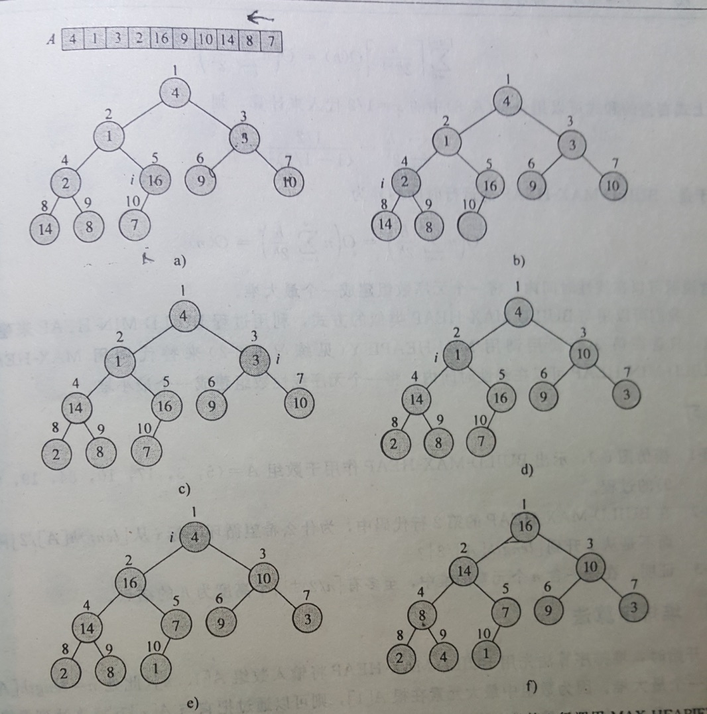
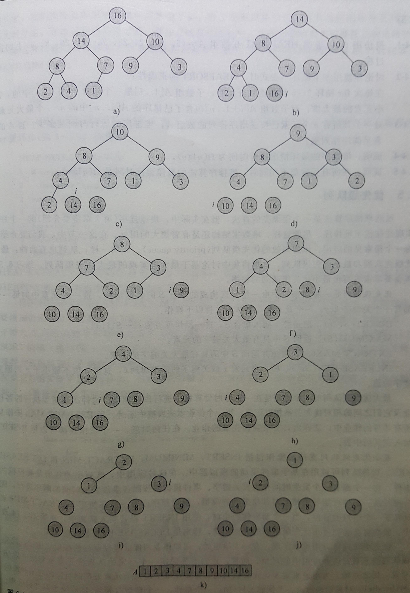

title: A02-堆排序
date: 2017-08-06	21:36
category:

- 算法

tags:

- 脑子秀逗
- 排序

------

## 堆

堆数据结构的特性
>数组表示（节点x；左子节点2x；右子节点2x+1）
完全二叉树、最后一层左子树开始填写
最大堆、最小堆定义：除了根节点最大或者最小，其他子节点不会大过（不会小于）父节点的值  

利用最小堆、最大堆得性质,逐步移除根节点，那么结果则为已排序数据。
举例数据：
```java
{4,1,3,2,16,9,10,14,8,7}
```
<!-- more -->

### 构建堆（大根堆）
堆排序分为如下几个步骤 a~f
- a) 数据数据堆表示
- b) 自底向上，数据7的父元素i（i--）维持最大堆特性
- c)~e) 按照对特性，循环保持
- f) 完成后的最大堆



### 堆排序
- 构建最大堆（对应升序排列）
- 从堆长度位置（数组尾部）开始遍历
- 交换A[i]与A[1]; 堆长度减一，因为交换前A1为最大元素
- 调整堆保持最大堆特性：adjust(A,1)。每次调整的代价为O(lg(n))
- i=2 退出循环，得到升序数组。 那么时间复杂度为n*O(lg(n))
上述流程的过程图如下



### 总结
- 初始化堆，即构建
- 维持堆特性，主要包含上浮、下沉操作

------

**版权声明：本文为博主原创文章，未经允许不得转载。**
